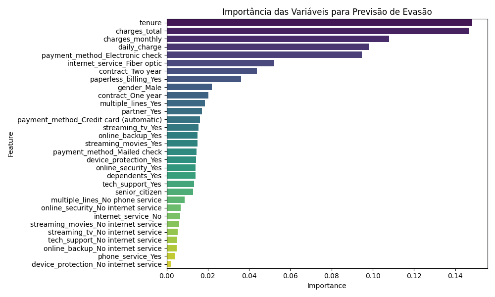
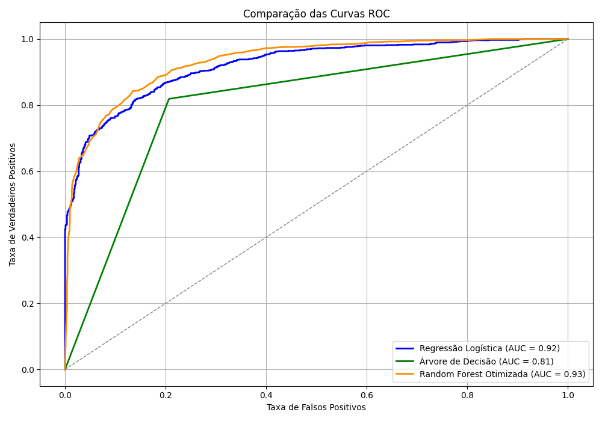

<h1 align="center">📡 Challeng-TelecomX_parte2_BR</h1>
<h2 align="center">Análise Preditiva de Evasão de Clientes</h2>


<br/>

# 📡 Challeng-TelecomX_parte2_BR

Este repositório documenta a segunda fase do projeto da **Telecom X**, onde desenvolvemos modelos de Machine Learning para prever a evasão de clientes (churn). O projeto abrange desde o pré-processamento dos dados até a interpretação dos resultados, com foco em entregar **insights estratégicos** que a empresa pode usar para reter clientes.

🎯 **Objetivo:**  
Prever a evasão de clientes em uma empresa de telecomunicações fictícia — a Telecom X — utilizando técnicas de aprendizado de máquina, análise exploratória de dados, visualizações interativas com Streamlit e boas práticas de projeto em ciência de dados.  
Este projeto foi criado para o desafio do programa **Oracle One**, do qual faço parte.

🧠 Desenvolvido com foco em aprendizado, melhoria contínua e contribuição à comunidade científica.


## 🔍 Etapas do Projeto

1. **Carregamento e Exploração dos Dados**
   - Leitura do arquivo `TelecomX_BR_normalizado.csv`
   - Inspeção inicial da estrutura e conteúdo

2. **Tratamento de Dados**
   - Remoção da coluna irrelevante `customer_id`
   - Preparação inicial para análise exploratória`

3. **Análise da Proporção de Classes**
   - Cálculo da proporção de clientes que cancelaram (`Yes`) e que permaneceram (`No`)
   - Identificação de desequilíbrio significativo entre as classes

4. **Análise Exploratória**
    - Geração de gráficos comparativos para variáveis categóricas e numéricas
    - Comparação com a variável alvo churn
    - Identificação de padrões relevantes para cancelamento

5. **Codificação de Variáveis Categóricas**
   - Aplicação de One-Hot Encoding (`pd.get_dummies`)
   - Exclusão da coluna `ID_Cliente` por não ser relevante

6. **Análise de Correlação**
   - Cálculo da matriz de correlação para variáveis numéricas e a variável alvo
   - Identificação das variáveis mais correlacionadas:

    - `tenure: tempo de permanência do cliente (em meses)`
     - `charges_monthly: valor mensal cobrado`
     - `daily_charge: valor médio diário cobrado (variável derivada)`
     - `charges_total: valor total cobrado ao longo do contrato`
     - `senior_citizen` (correlação negativa)

    **Principais insights:**

    - Clientes com menor tempo de permanência (tenure) apresentam maior propensão ao churn.

    - Valores elevados de cobrança (charges_monthly e charges_total) estão associados a maior taxa de saída.

    - A variável derivada daily_charge ajuda a normalizar o impacto financeiro e mostrou boa correlação com o churn.

7. **Análise Exploratória de Variáveis-Chave**
    - Boxplots para churn vs tenure, charges_total
    - Conclusão: clientes que cancelam tendem a ter menor tempo de permanência e menor cobrança total

8. **Preparação para Modelagem**
   - Separação de features (`X`) e alvo (`y`)
   - Divisão em treino (80%) e teste (20%) com estratificação
   - Aplicação de SMOTE para balancear classes no treino

9. **Modelagem Preditiva**
   - Modelos utilizados:
     - Regressão Logística
     - Árvore de Decisão
     - Random Forest Otimizada
   - Avaliação com métricas: precisão, recall, f1-score
   - Geração de matrizes de confusão

9. **Otimização de Hiperparâmetros (Random Forest)**
   - Uso do `GridSearchCV` otimizando para `f1-macro`
   - Melhores parâmetros encontrados:
     ```python
     {'class_weight': 'balanced', 'max_depth': 15, 'min_samples_split': 2, 'n_estimators': 100}
     ```

10. **Importância das Variáveis**
A importância das variáveis foi avaliada com base no modelo Random Forest, utilizando a métrica de feature_importance_. Abaixo estão as 10 variáveis mais relevantes para a previsão de churn:


| Variável                               | Importância (%)| 
|----------------------------------------|----------------|
| tenure                                 |14.83%          |
| charges_total                          |14.67%          |
| charges_monthly                        |10.79%          |
| daily_charge                           |9.80%           |
| payment_method_Electronic check        |9.48%           |
| internet_service_Fiber optic           |5.23%           |
| contract_Two year                      |4.39%           |
| paperless_billing_Yes                  |3.60%           |
| gender_Male                            |2.19%           |
| contract_One year                      |2.04%           |


Interpretação:

As variáveis numéricas relacionadas a tempo e cobrança são as mais influentes.

O método de pagamento eletrônico (Electronic check) se destaca entre as variáveis categóricas.

O tipo de contrato e o serviço de internet também impactam fortemente a decisão de permanência.


### 📊 Gráfico de Importância das Variáveis

Este gráfico mostra as variáveis que mais influenciam a evasão de clientes segundo o modelo Random Forest:



---

# 🧠 Discussão Crítica
### A análise comparativa entre os modelos de Regressão Logística — com e sem as variáveis charges_total e daily_charge — teve como objetivo avaliar o impacto da multicolinearidade na performance preditiva.

### Embora essas variáveis apresentem alta correlação com charges_monthly, os resultados mostraram que sua exclusão não trouxe ganhos significativos. Pelo contrário, houve uma leve queda nos principais indicadores de desempenho:

### Acurácia, Precision, Recall e AUC foram inferiores

### F1-score teve uma melhora marginal (+0.0054), estatisticamente irrelevante

### Esses achados indicam que, apesar da presença de multicolinearidade, o modelo original com todas as variáveis balanceadas permanece mais robusto e eficaz. A multicolinearidade não comprometeu a estabilidade dos coeficientes nem a capacidade preditiva do modelo.

### Além disso, a abordagem adotada demonstra boas práticas de modelagem:

### Teste de hipóteses com base em fundamentos estatísticos

### Validação empírica com métricas objetivas

### Escolha consciente do conjunto de variáveis com melhor desempenho

## ✅ Decisão final: 
### Manteremos o conjunto de variáveis definido após o balanceamento para todos os testes, validações e comparações entre modelos. Essa escolha é respaldada por evidência quantitativa e garante maior confiabilidade nos resultados futuros.

---

## 🔹 Resultados e Interpretação

## 📈 Resultados

A Random Forest superou os modelos anteriores, especialmente em **recall da classe positiva** (`Cancelou_Yes`).  
Ela demonstrou equilíbrio entre todas as métricas, o que é raro e valioso em problemas de churn.

### 📊 Comparativo de Modelos

| Modelo              | Acurácia | Precision (Churn) | Recall (Churn) | F1-score (Churn) |
|---------------------|----------|-------------------|----------------|------------------|
| Árvore de Decisão   | 0.83     | 0.82              | 0.83           | 0.82             |
| Regressão Logística | 0.84     | 0.84              | 0.84           | 0.84             |
| Random Forest       | 0.85     | 0.85              | 0.85           | 0.85             |

🧠 **Interpretação:**  
Consistência total entre as métricas indica que o modelo está bem calibrado.  
A Random Forest foi escolhida para o modelo final de deploy por manter alto desempenho mesmo em dados reais.

### 📉 Curvas ROC Comparativas

O gráfico abaixo mostra a capacidade de discriminação dos modelos.  
A Random Forest obteve a maior AUC, indicando excelente desempenho.



## 🔹 Tabela de Interpretação da AUC

### 🎯 Interpretação da AUC

| AUC Score     | Interpretação     |
|---------------|-------------------|
| 0.50–0.60     | Fraco (quase aleatório) |
| 0.60–0.70     | Regular            |
| 0.70–0.80     | Bom                |
| 0.80–0.90     | Muito bom          |
| 0.90–1.00     | Excelente          |

🔥 A Random Forest atingiu uma AUC de **0.93**, o que indica altíssima capacidade de distinguir entre clientes que vão sair e os que vão permanecer.


## 🛠️ Estratégias Recomendadas

- Criar programas de retenção focados nos primeiros meses de serviço
- Incentivar contratos de longo prazo
- Promover serviços agregados (Suporte Técnico, Segurança Online)
- Investigar causas de evasão entre clientes de fibra óptica
- Usar o modelo Random Forest para prever clientes de alto risco e oferecer ações de retenção personalizadas


## 🧰 Tecnologias Utilizadas

- Python (Pandas, NumPy, Matplotlib, Seaborn, Scikit-learn, Imbalanced-learn)
- Jupyter Notebook
- SMOTE para balanceamento
- GridSearchCV para otimização
- Streamlit para visualizações interativas


## 📁 Estrutura de Arquivos

├── TelecomX_BR_normalizado.csv # Base de dados tratada 

├── Telecom_X_–_Parte_2_Prevendo_Churn.ipynb # Análises e modelagem 

├── README.md # Documentação do projeto


## ✒️ Autor ✒️

Projeto desenvolvido por **Eduardo Marchi** como parte do Challenge da Trilha de Especialização em Data Science do Programa ONE G8: **Oracle Next Education** em parceria com a Alura:

**Eduardo Marchi**
Desenvolvedor de soluções em ciência de dados com foco em impacto real e aprendizado contínuo.

* 📎 GitHub: [](https://github.com/Eduardo-Marchi2025)
* : https://www.linkedin.com/in/eduardo-marchi-42b371348/
* 📧 e-mail: eduardo.marchi@gmail.com

---


## 📝 Licença
Projeto para fins educacionais.
